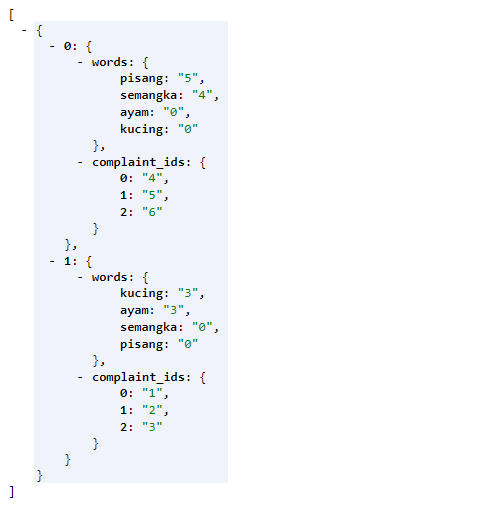

# lda-topic-model
Latent dirchlect Allocation Topic Modelling in PHP
ingin tahu apa itu lda dan topic model? goto here https://medium.com/@ranggaantok/topic-modelling-menggunakan-latent-dirchlect-allocation-3fdf979ffd05

# Install
install via composer<br>
```composer require rangga/lda-topic-model```

# Usage
```
<?php
require_once __DIR__.'/vendor/autoload.php';

use TopicModel\Lda;

$lda = new Lda;
$documents[] =["id"=>1,"tokens"=>["kucing","ayam"]];
$documents[] =["id"=>2,"tokens"=> ["ayam","semangka","kucing"]];
$documents[] =["id"=>3,"tokens"=> ["ayam","kucing"]];
$documents[] =["id"=>4,"tokens"=> ["semangka","pisang"]];
$documents[] =["id"=>5,"tokens"=> ["pisang","pisang","semangka","pisang"]];
$documents[] =["id"=>6,"tokens"=> ["pisang","semangka"]];
$alpha = 0.1;
$beta = 0.1;
$n_topic = 2;
print_r($lda->modelling($documents,$n_topic,$alpha,$beta));
    
?>
```

dan hasilnya <br><br>


